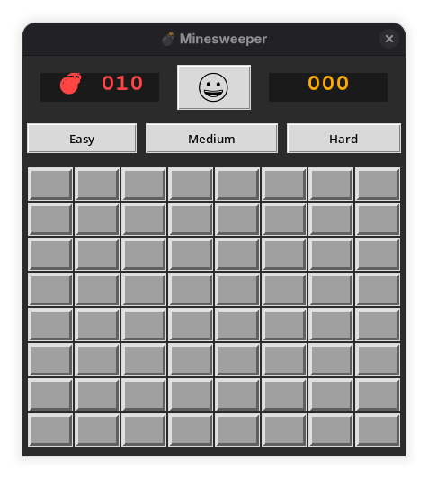

# 💣 Minesweeper GUI

A modern, polished version of the classic Minesweeper game built with Python and Tkinter.



## ✨ Features

- **Clean GUI** with a retro-modern look
- **Three difficulties**: Easy (8x8, 10 mines), Medium (16x16, 40 mines), Hard (22x22, 99 mines)
- **First-click safety** — never hit a mine on your first move
- **Classic gameplay**: Left-click to reveal, Right-click to flag
- **Visual feedback**: Colored numbers, emojis (💣 🏴), smiley face moods
- **Live timer** and remaining mines counter
- **Auto-reveal** for zero cells (flood fill)
- **Win/Loss detection** with fun messages
- **Cross-platform** support

## 🎮 Controls

- **Left Click**: Reveal cell
- **Right Click**: Toggle flag
- **Smiley Face**: Restart game
- **Difficulty buttons**: Change board size

## 🚀 Installation

### Prerequisites

- Python 3.8 or higher

### 1. Clone the Repository

```bash
git clone https://github.com/yourusername/minesweeper-gui.git
cd minesweeper-gui

macOS

# Install Python via Homebrew (recommended)
brew install python

# Install Tkinter
brew install python-tk

# Or if using system Python:
python3 -m tkinter

Linux

Fedora/Red Hat/ Rocky / AlmaLinux:

sudo dnf update
sudo dnf install python3-tkinter tk

Ubuntu/ Debian/ Linux Mint/ Pop!_OS:

sudo apt update
sudo apt install python3-tk python3-pil python3-pil.imagetk

Arch Linux/ Manjaro:

sudo pacman -Syu python tk

openSUSE:

sudo zypper install python3-tk


🛠️ How to Play

Choose your difficulty
Click on cells to reveal numbers
Numbers show how many mines are in the surrounding 8 cells
Right-click to flag suspected mines
Clear all non-mine cells to win!

🎨 Customization Ideas

Add sound effects (pygame)
High score system
Dark/Light mode toggle
Custom tile graphics
Particle effects on explosions

🐛 Known Issues

High DPI scaling issues on some Linux setups
Timer continues running after game ends (easy fix)

🤝 Contributing
Contributions are welcome!

